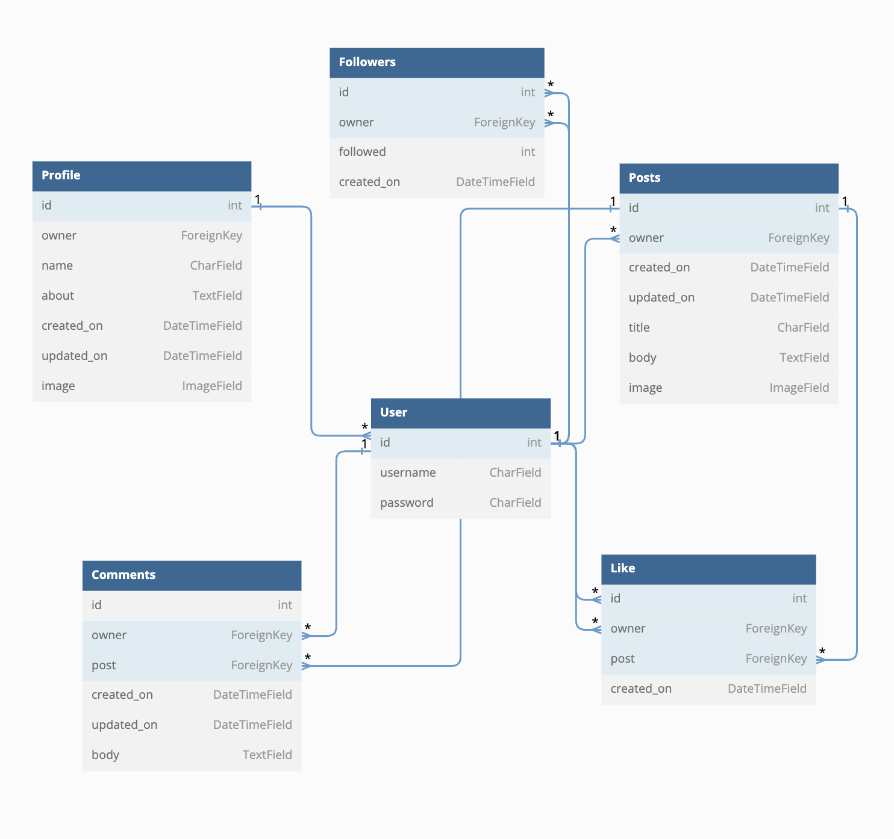

# Nexus DRF API
Developed by, [Dan Pearce](https://danpearce.software/)

[View the live application](https://ci-pp5-nexus-drf-danpearce.herokuapp.com/)

The Nexus DRF API has been built for the purposes of providing data to the Nexus application. The API project has been built using the Django REST Framework.

[View the live Nexus application here](https://ci-pp5-nexus-danpearce.herokuapp.com/)
[View the Nexus GitHub page here](https://github.com/DanPearce/CI_PP5_Nexus)

## Contents
1. [User Stories](#user-stories)
2. [Database and Models](#database-and-models)
3. [Technologies](#technologies)
4. [Validation and Testing](#validation-and-testing)
5. [Credits](#credits)
6. [Acknowlegements](#acknowlegements)

## User Stories
The DRF API has only one user story as the live API is only used for administration purposes.

1. USER STORY 3: User Authentication - Admin Moderation
  - As an Owner, I can log into the admin console, so that I can moderate the content on the site.

## Database & Models
### Database
This project was built using a relational database allowing us to easily link aspects of the site with others.

During development, I used [DB SQLite which](https://www.sqlite.org/) which is the default database to use for Django - and for production [ElephantSQL](https://www.elephantsql.com/) has been used and all data migrated during the deployment.

Diagram

### Models

#### Users
The User Model comes installed with the Django AllAuth Library and is used to connect with various features of the application
- Has a One to One Relationshop with Profiles; owner field.
- Has a ForeignKey relationship with Followers; owner and followed feilds.
- Has a ForeignKey relationship with Posts; owner field.
- Has a ForeignKey relationship with Comments; owner field.
- Has a ForeignKey relationship with Likes; owner field.

#### Profiles
- Fields (owner, name, about, created_on, updated_on, image)
- Has a One to One relationship with User, id.

#### Posts
- Fields (owner, title, body, created_on, updated_on, image)
- Has a ForeignKey relationship with Comments, post and Like, post.

#### Followers
- Fields (owner, followed, created_on)
- Has a ForeignKey relationship with User, id.

#### Comments
- Fields (owner, post, body, created_on, updated_on)
- Has a ForeignKey relationship with User, id and Posts, id.

#### Likes
- Fields (owner, post, created_on)
- Has a ForeignKey relationship with User, id and Posts, id.

## Technologies
### Languages
- [Python](https://www.python.org/)
- [Django](https://www.djangoproject.com/)

### Libraries, Frameworks and Other Technologies
- [Django](https://www.djangoproject.com) - This side of the project has been created using django .
- [Cloudinary](https://cloudinary.com/) - Used to host the images used on the site.
- [Git](https://git-scm.com/) - Used to implement version control within the project.
- [GitHub](https://github.com/) Used to host my code.
- [GitPod](https://www.gitpod.io/) Used to build my code online.
- [VS Code](https://code.visualstudio.com) - Used occasionally to build the code offline.
- [Heroku](https://dashboard.heroku.com/) - Used to host the live version of the site.
- [Psycopg2](https://www.psycopg.org/docs/) Used to create the database on the development version of the site.
- [ElephantSQL](https://www.elephantsql.com/) - Used to host the database for the live site.
- [DB Diagram.io](https://dbdiagram.io/) - Used to create the diagrams used for the models.
- [PyCodeStyle](https://pypi.org/project/pycodestyle/) - Used to validate the Python code.
- [Python](https://www.python.org/) - Code written in python.
- [Django REST Framework](https://www.django-rest-framework.org/) used for the creation of the API.
- [Django AllAuth](https://django-allauth.readthedocs.io/en/latest/index.html) used for user authenticaion/creation.

