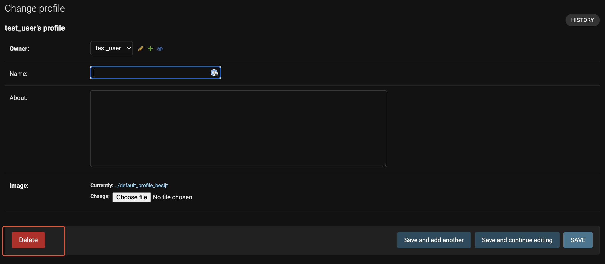
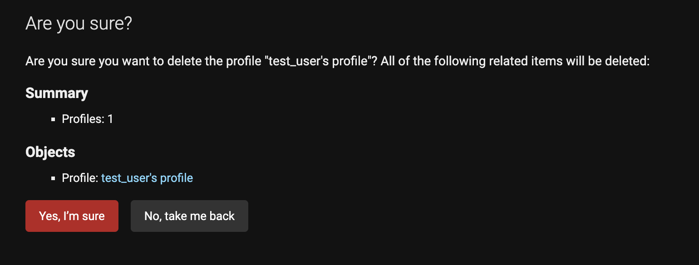

# Nexus DRF API
Developed by, [Dan Pearce](https://danpearce.software/)

[View the live application](https://ci-pp5-nexus-drf-danpearce.herokuapp.com/)

The Nexus DRF API has been built for the purposes of providing data to the Nexus application. The API project has been built using the Django REST Framework.

[View the live Nexus application here](https://ci-pp5-nexus-danpearce.herokuapp.com/)

[View the Nexus GitHub page here](https://github.com/DanPearce/CI_PP5_Nexus)

## Contents
1. [User Stories](#user-stories)
2. [Database and Models](#database-and-models)
3. [Technologies](#technologies)
4. [Validation and Testing](#validation-and-testing)
5. [Deployment](#deployment)
6. [Credits](#credits)
7. [Acknowlegements](#acknowlegements)

## User Stories
The DRF API has only two user stories as the live API is only used for administration purposes for the front end application.

1. USER STORY 3: User Authentication - Admin Moderation
  - As an Owner, I can log into the admin console, so that I can moderate the content on the site.
2. USER STORY 24: User Interactivity – Filter#
  - As a Owner, I can filter posts/profiles, so that I can find the content that I need.

## Database & Models
### Database
This project was built using a relational database allowing us to easily link aspects of the site with others.

During development, I used [DB SQLite which](https://www.sqlite.org/) which is the default database to use for Django - and for production [ElephantSQL](https://www.elephantsql.com/) has been used and all data migrated during the deployment.

Diagram

### Models

#### Users
The User Model comes installed with the Django AllAuth Library and is used to connect with various features of the application
- Has a One to One relationship with Profiles; owner field.
- Has a ForeignKey relationship with Followers; owner and followed fields.
- Has a ForeignKey relationship with Posts; owner field.
- Has a ForeignKey relationship with Comments; owner field.
- Has a ForeignKey relationship with Likes; owner field.

#### Profiles
- Fields (owner, name, about, created_on, updated_on, image)
- Has a One to One relationship with User, id.

#### Posts
- Fields (owner, title, body, created_on, updated_on, image)
- Has a ForeignKey relationship with Comments, post and Like, post.

#### Followers
- Fields (owner, followed, created_on)
- Has a ForeignKey relationship with User, id.

#### Comments
- Fields (owner, post, body, created_on, updated_on)
- Has a ForeignKey relationship with User, id and Posts, id.

#### Likes
- Fields (owner, post, created_on)
- Has a ForeignKey relationship with User, id and Posts, id.

## Technologies
### Languages
- [Python](https://www.python.org/)
- [Django](https://www.djangoproject.com/)

### Libraries, Frameworks and Other Technologies
- [Django](https://www.djangoproject.com) - This side of the project has been created using django .
- [Cloudinary](https://cloudinary.com/) - Used to host the images used on the site.
- [Git](https://git-scm.com/) - Used to implement version control within the project.
- [GitHub](https://github.com/) Used to host my code.
- [GitPod](https://www.gitpod.io/) Used to build my code online.
- [VS Code](https://code.visualstudio.com) - Used occasionally to build the code offline.
- [Heroku](https://dashboard.heroku.com/) - Used to host the live version of the site.
- [Psycopg2](https://www.psycopg.org/docs/) Used to create the database on the development version of the site.
- [ElephantSQL](https://www.elephantsql.com/) - Used to host the database for the live site.
- [DB Diagram.io](https://dbdiagram.io/) - Used to create the diagrams used for the models.
- [PyCodeStyle](https://pypi.org/project/pycodestyle/) - Used to validate the Python code.
- [Python](https://www.python.org/) - Code written in python.
- [Django REST Framework](https://www.django-rest-framework.org/) used for the creation of the API.
- [Django AllAuth](https://django-allauth.readthedocs.io/en/latest/index.html) used for user authentication/creation.

## Validation and Testing
### PyCodeStyle Validation
All Python Code has been checked using the [PyCodeStyle](https://pypi.org/project/pycodestyle/) library. All code has been returned with no errors.

All .py files

### Testing 
#### Manual Testing
As an Owner, I can log into the admin console, so that I can moderate the content on the site.

| **USER STORY 1** | **User Action** | **Desired Outcome** | **Actual Outcome** |
|------------------|-----------------|---------------------|--------------------|
| User | Create, edit and delete | Admin is able to create, edit and delete a new user (Which makes a user profile). | Works as intended. |
|

User Create

 

User Create

 | | | |

| **USER STORY 1** | **User Action** | **Desired Outcome** | **Actual Outcome** |
|------------------|-----------------|---------------------|--------------------|
| User | Change user permissions | Admin is able to edit permissions for a user. | Works as intended. |
| 

User Permissions

 | | | |

| **USER STORY 1** | **User Action** | **Desired Outcome** | **Actual Outcome** |
|------------------|-----------------|---------------------|--------------------|
| Profiles | Create and delete | Admin is able to create and delete a Profile. | Works as intended. |
| 

Profiles Edit

 

Profiles Delete

 

Profiles Delete

 

Profiles Delete

 | | | |

| **USER STORY 1** | **User Action** | **Desired Outcome** | **Actual Outcome** |
|------------------|-----------------|---------------------|--------------------|
| Posts | Create, edit and delete | Admin is able to create, edit and delete a post. | Works as intended. |
| 

Posts Create

 

Posts Edit

 

Posts Delete

 

Posts Delete

 

Posts Delete

 | | | |

| **USER STORY 1** | **User Action** | **Desired Outcome** | **Actual Outcome** |
|------------------|-----------------|---------------------|--------------------|
| Comments | Create and delete | Admin is able to create, edit and delete a comment. | Works as intended. |
| 

Comments Create

 

Comments Create

 

Comments Delete

 

Comments Delete

 

Comments Delete

 | | | |

| **USER STORY 1** | **User Action** | **Desired Outcome** | **Actual Outcome** |
|------------------|-----------------|---------------------|--------------------|
| Likes | Create and delete | Admin is able to create and delete a like. | Works as intended. |
| 

Likes Create

 

Likes Create

 

Likes Delete

Likes Delete

Likes Delete

 | | | |

| **USER STORY 1** | **User Action** | **Desired Outcome** | **Actual Outcome** |
|------------------|-----------------|---------------------|--------------------|
| Followers | Create and delete | Admin is able to create delete a new follower. | Works as intended. |
| 

Followers Create

 

Followers Create

Followers Delete

 

Followers Delete

Followers Delete

 | | | |

| **USER STORY 24** | **User Action** | **Desired Outcome** | **Actual Outcome** |
|-------------------|-----------------|---------------------|--------------------|
| Filter | Use the search or filter option in the admin console. | Admin is able to filter content. | Works as intended. |
| 

Filter 1

Filter 2

Filter 3

 | | | |

## Deployment
The Nexus DRF uses Cloudinary to host images, Heroku to host the website and ElephantSQL to host the database.
The deployment process for this application is as followed:
1. Create an account or Log into [ElephantSQL](https://www.elephantsql.com/).
2. Create New Instance
3. Select a plan, name and region.
4. Review the plan and Create Instance.
5. Find the recently created instance on the dashboard, click onto this and find the URL section and make a note of this.
6. Create an account or Log into [Heroku](https://dashboard.heroku.com/).
7. Click New > Create new app, and select the correct region for this to be hosted > Create App.
8. Once created, Navigate to the settings tab, and enter a new Config Var called DATABASE_URL, paste in the URL from ElephantSQL. (No Quotation marks)
9. Add the new DATABASE_URL to your env.py file.
10. Within the project terminal, run `pip3 install dj_database_url==0.5.0 psycopg2`.
11. Navigate to settings.py and add `import dj_database_url` underneath `import os`.
12. Add the following code to settings.py 

`if 'DEV' in os.environ:
    DATABASES = {
        'default': {
            'ENGINE': 'django.db.backends.sqlite3',
            'NAME': BASE_DIR / 'db.sqlite3',
        }
    }
else:
    DATABASES = {
        'default': dj_database_url.parse(os.environ.get('DATABASE_URL'))
    }`

13. Ensure to comment out the `DEV` environment variable to ensure connection to the new database, add a print statement to confirm.
14. Make a dry run as a test of the connection to the database, if successful make migrations `python3 manage.py migrate`
15. Install gunicorn for heroku deployment `pip3 install gunicorn django-cors-headers`.
16. Update the requirements.txt file `pip3 freeze --local > requirements.txt`.
17. Create `Procfile` and add the following code:
`release: python manage.py makemigrations && python manage.py migrate 
web: gunicorn drf_api.wsgi`.
18. In Heroku, find the app URL for the live application and copy, then add this to settings.py under `ALLOWED_HOSTS`.
19. Add `corsheaders` to INSTALLED_APPS and add `   corsheaders.middleware.CorsMiddleware
` to the top of MIDDLEWARE.
20. Under MIDDLEWARE add the following code:
`if 'CLIENT_ORIGIN' in os.environ:
    CORS_ALLOWED_ORIGINS = [
        os.environ.get('CLIENT_ORIGIN')
     ]`
21. Under the existing JWT code add `JWT_AUTH_SAMESITE = 'None'`
22. Ensure the secret key is hidden in evy.py and replace with `SECRET_KEY = os.environ.get('SECRET_KEY')` 
23. Ensure the DEBUG value is added to env.py and replace with the following code `DEBUG = 'DEV' in os.environ`
24. Set value of DEBUG to '0' in env.py
25. Update the requirements.txt file `pip3 freeze --local > requirements.txt`.
26. Commit and Push all code.
27. In the Heroku app, open settings and ensure `SECRET_KEY` and `CLOUDINARY_URL` from env.py have been added as Config vars
28. Open the deploy tab, and connect with the GitHub repository, under manual deploy, deploy.
29. Wait for all changes to be made.
30. Enjoy!

The following steps can be followed to clone the project:
1. Navigate to GitHub and login to your account.
2. Navigate to the repository you wish to clone.
3. Under the green 'Code' dropdown, select your preferred cloning option.
4. On your machine, please navigate either to your editor / cmd / terminal.
5. Ensure your directory is changes to the location you wish to clone the project.
6. In the terminal type git clone and followed by the URL you selected earlier.
7. The project will be cloned to the location chosen.

## Credits
### Code
I learnt how to create this project using the code from my course with Code Institute. 
[Moments DRF](https://github.com/Code-Institute-Solutions/drf-api)

- [Custome Exception Handling](https://www.youtube.com/watch?v=WUMEAZWM5xE&ab_channel=CryceTruly) - Used to broaden my knowledge on exception handling.

### Images
- [Default User Image](https://pixabay.com/vectors/blank-profile-picture-mystery-man-973460/) by [WandererCreative](https://pixabay.com/users/wanderercreative-855399/)

## Acknowledgements
As always there are some people I would especially like to thank for their continued support throughout my coding journey.
- Thank you to my mentor, Mo Shami, for providing me quality information in the past months.
- Thank you to my partner, Harry for allowing me to have the time to continue my efforts.
- Thank you to you, for taking the time to look at my work!

#### [Back to Top](#contents)